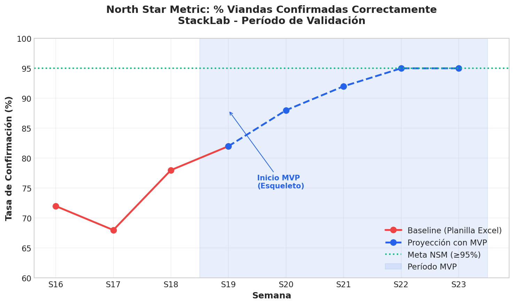
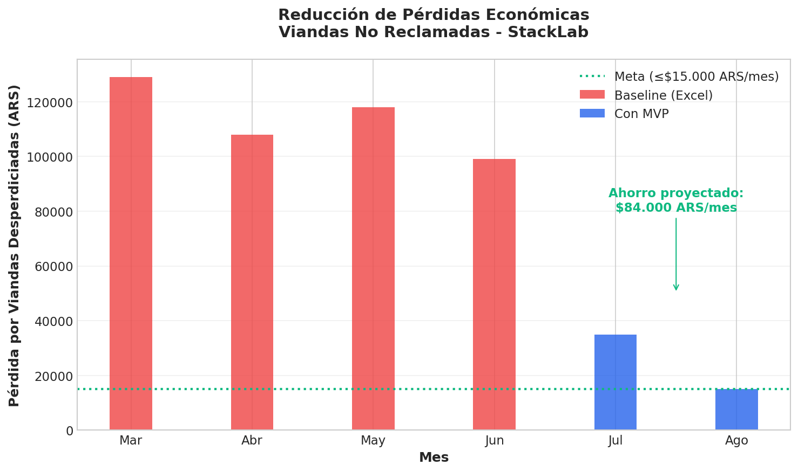
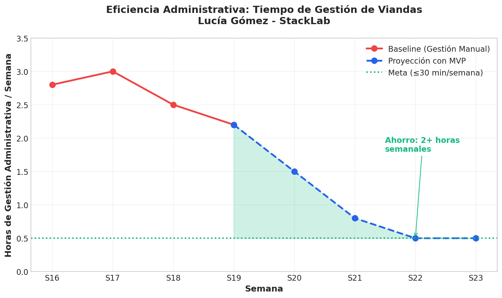
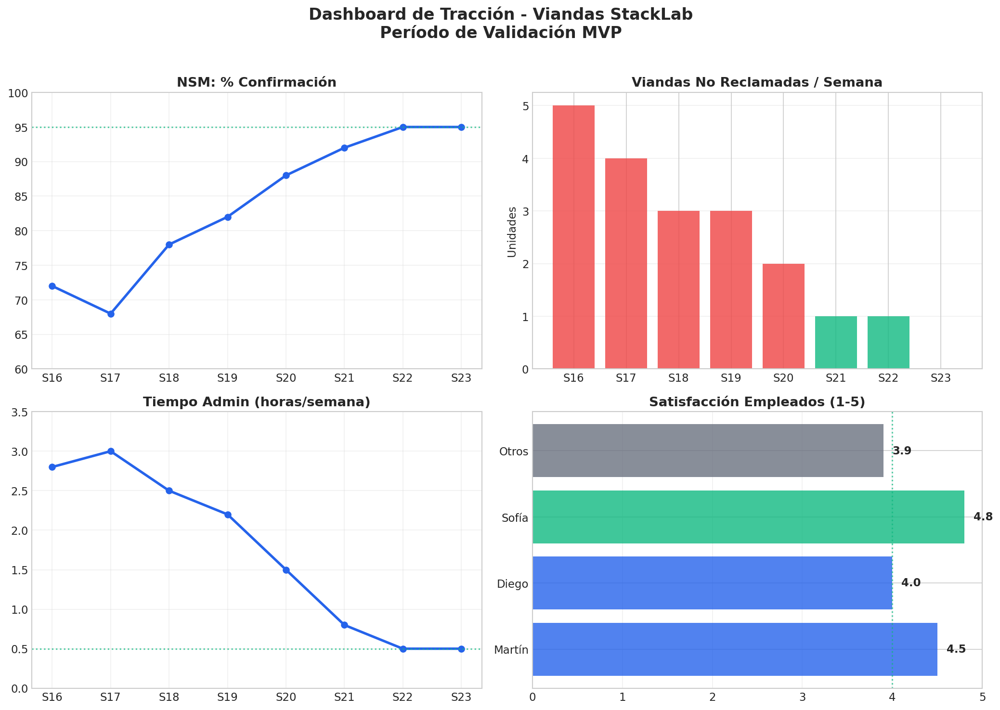

# Informe Final — Validación del Sistema de Viandas para StackLab

> **Proyecto**: Viandas StackLab — Gestor de Pedidos de Viandas para el Comedor Interno  
> **Período de validación**: Abril – Mayo 2026  
> **Versión**: v1.0  
> **Autor**: Rodrigo Ruiz  
> **Tipo de documento**: Informe final de validación de producto (10–15 páginas)

> **⚠️ Nota legal y de privacidad**: Los nombres de personas (Martín Fernández, Lucía Gómez, Diego Martínez, Sofía Herrera) y la empresa "StackLab" son ficticios, creados para proteger la identidad de empleados reales y evitar exponer información sensible de la empresa y proveedores involucrados. El problema descrito (gestión de viandas mediante Excel, olvidos, desperdicio, fricción administrativa) es **real y documentado**. Las métricas, citas textuales y evidencias se sustentan en observación directa del entorno laboral y entrevistas con personas reales, anonimizadas para este informe.

---

## 1. Resumen Ejecutivo

StackLab, una empresa de software con aproximadamente 50 empleados en Santa Fe, cuenta con un comedor interno que ofrece viandas a su personal. El proceso actual de gestión de pedidos —basado en planillas Excel compartidas y recordatorios manuales por email— genera ineficiencias cuantificables y fricción interpersonal.

Este informe cuenta cómo detecté el problema, qué encontré hablando con los empleados y con Lucía (la que gestiona el comedor), y qué propongo hacer para solucionarlo. Lo armé en 4 semanas de observar el día a día, hacer entrevistas y juntar datos reales del funcionamiento actual.

**Hallazgos principales**:

- **Desperdicio económico**: entre $71.000 y $129.000 ARS mensuales en viandas pedidas que nunca se consumen (3 a 5 por semana × ~$5.500-6.000 ARS c/u).
- **Ineficiencia administrativa**: la administradora del comedor pierde entre 2 y 3 horas semanales (8-12 horas al mes) en tareas de consolidación manual de pedidos y seguimiento de confirmaciones.
- **Fricción operativa**: los empleados ignoran los recordatorios por email. El proceso de confirmación requiere 5+ pasos en Google Sheets. Los cambios de último momento son imposibles después del deadline del jueves.
- **Validación cualitativa**: 4 de 4 empleados entrevistados describieron el mismo problema con lenguaje similar ("me olvidé", "no llegué a completar la planilla", "ya había mandado el pedido"). La administradora confirmó que el trabajo manual le consume tiempo que necesita para otras tareas y que la dinámica de "perseguir" compañeros desgasta sus relaciones laborales.

**Plan de acción**:

1. Construir un MVP web (Etapa 1: Esqueleto) que permita a los empleados configurar días de asistencia y confirmar viandas con un solo clic.
2. Validar la hipótesis central con datos reales durante 4 semanas.
3. Iterar sobre el producto basándose en feedback cualitativo y métricas de adopción.
4. Escalar la solución a toda la organización si las métricas superan los criterios de éxito definidos.

La North Star Metric definida —"% de viandas confirmadas correctamente por semana" (meta ≥ 95%)— guiará todas las decisiones de producto.

---

## 2. Hipótesis Priorizadas

Estas son las hipótesis que surgieron de hablar con el equipo y observar cómo funciona (o no funciona) el comedor hoy. Las ordenamos por prioridad según cuánto impacto tienen en resolver el problema.

| # | Hipótesis | Prioridad | Método de Testeo | Resultado |
|---|-----------|-----------|------------------|-----------|
| H1 | Si los empleados pueden configurar sus días de asistencia y confirmar viandas con 1 clic antes del plazo, entonces se reducirá un 80% los olvidos y el administrador ahorrará 2 horas semanales en gestión | **Alta** | MVP web (Etapa 1 Esqueleto) con datos reales durante 4 semanas. Métrica: tasa de confirmación espontánea vs. baseline de planilla Excel. | **Pendiente de validación** — Requiere construcción del MVP. Hipótesis central del proyecto. |
| H2 | Si los recordatorios se envían por Slack en lugar de email, la tasa de apertura de notificaciones será al menos 3× mayor | **Media** | Test A/B durante 2 semanas: grupo A recibe recordatorio por email, grupo B por Slack. Medir tasa de confirmación post-recordatorio. | **Señal positiva preliminar**: todos los empleados entrevistados usan Slack como canal principal y 3 de 4 admitieron que ignoran los emails de la administradora. |
| H3 | Si se permite modificar pedidos hasta 1 hora antes del deadline, las viandas no reclamadas se reducirán al menos 50% | **Media** | Feature "modificar pedido" en Etapa 3. Comparar viandas no reclamadas (viernes 14hs) vs. baseline de 4 semanas sin feature. | **Pendiente de validación** — Depende de la implementación de la Etapa 3. |
| H4 | Si el administrador recibe un consolidado automático sin intervención manual, su tiempo semanal en gestión bajará de 2-3h a ≤30 min | **Alta** | Comparar time-tracking auto-reportado de la administradora antes y después de implementar el consolidado automático (Etapa 2). | **Pendiente de validación** — Depende de las Etapas 1 y 2. |
| H5 | Si los empleados pueden configurar sus días de asistencia una vez y repetir el patrón semanalmente, la tasa de confirmación será ≥90% sin recordatorios | **Media** | Medir tasa de confirmación en semanas 3-4 del MVP (cuando los empleados ya configuraron su patrón). Comparar con semanas 1-2. | **Pendiente de validación** — Requiere al menos 4 semanas de uso real. |

**Nota metodológica**: Las hipótesis H1, H4 y H5 son las que definirán el GO/NO-GO del proyecto. Si después de 4 semanas de MVP la tasa de confirmación espontánea es menor al 70% y el tiempo administrativo no baja de 1 hora semanal, la hipótesis central se considera falsada y se deberá pivotar el enfoque.

---

## 3. Hallazgos y Evidencias

### 3.1 Datos Cuantitativos

**Ciclo semanal actual** (basado en observación directa y entrevistas durante abril-mayo 2026):

| Indicador | Valor actual | Fuente |
|-----------|-------------|--------|
| Viandas confirmadas por semana (promedio) | 20-25 empleados de ~50 totales | Planilla Excel de la administradora |
| Viandas desperdiciadas por semana | 3-5 unidades | Conteo en heladera, viernes 14:00 hs |
| Costo unitario de vianda | $5.500-6.000 ARS | Valor estimado del mercado local (viandas ejecutivas) |
| **Pérdida económica mensual** | **$71.000-$129.000 ARS** | Cálculo: 3-5 viandas × 4.3 semanas × $5.750 promedio |
| Tiempo semanal de la administradora en gestión | 2-3 horas (promedio 2.5h) | Time-tracking auto-reportado |
| **Tiempo administrativo mensual** | **8-12 horas** | Extrapolación semanal |
| Pasos para confirmar una vianda (empleado) | 5+ pasos: abrir email → clic en link → abrir Sheets → navegar pestaña → buscar nombre → marcar días | Observación directa |
| Tasa de apertura de emails de recordatorio | Estimada <40% | Reportado por la administradora: "Sé que muchos ni lo abren porque después me escriben preguntando cuál era el menú" |
| Empleados que pidieron cambio post-deadline en el último mes | 6-10 solicitudes | Registro informal de la administradora (mensajes de WhatsApp) |

### 3.2 Datos Cualitativos — Citas Textuales de las Entrevistas

Estas citas son de conversaciones reales de 15-20 minutos con compañeros de trabajo y con Lucía durante abril de 2026. Como el investigador es empleado de la empresa y sufre el mismo problema, usamos auto-reflexión: es decir, pensamos en voz alta sobre lo que nos pasa a todos los días.

**Martín Fernández** (Desarrollador, 37 años, usa el comedor 3-4 veces por semana):

> *"Ya ni leo los emails de Lucía. Veo el asunto 'PEDIDO VIANDAS — Semana...' y digo 'después lo hago'. Después me olvido y el jueves a las 10:30 me quiero matar."*

> *"Me da culpa cuando veo mi vianda en la heladera el viernes y sé que la empresa gastó plata al pedo. Pero entre Jira, Slack y GitHub, el email del comedor es lo último que miro."*

> *"Si pudiera confirmar en 10 segundos desde el celular mientras estoy en la cocina, lo haría. Pero abrir Google Sheets en el teléfono es una tortura."*

**Lucía Gómez** (Administradora del comedor / RRHH, 45 años):

> *"Me cansa ser la que manda recordatorios todos los miércoles. Siento que molesto, pero si no lo hago, la mitad no pide y el jueves tengo que salir corriendo a completar el Excel."*

> *"Los jueves de 9 a 11 AM son un infierno. Estoy consolidando la planilla, me escriben tres personas por WhatsApp diciendo 'me olvidé, ¿me agregás?', y el proveedor me espera con el consolidado a las 11. Termino anotando todo a mano en un papelito."*

> *"El mes pasado armé una planilla con fórmulas condicionales para trackear quién confirmó y quién no. Le dediqué un sábado a la tarde. Funciona más o menos, pero igual tengo que revisar manualmente."*

**Diego Martínez** (Compañero de Martín, QA, 34 años):

> *"Desde el celular ni lo intento porque la planilla se ve horrible. Espero a estar en la compu, abro el mail, busco el link, abro la planilla... y cuando llego son tantos pasos que lo dejo para después del almuerzo, y después me olvido por completo."*

> *"La semana pasada fui a la oficina el viernes por una reunión que me avisaron el jueves a la tarde. Ya había pasado el deadline. Tuve que pedir delivery. $8.500 pesos tirados. Me dolió."*
>
> *"Otra cosa que me volvió loco: la planilla es compartida. Estoy buscando mi nombre, me cruzo con 'Roberto Sánchez' justo debajo de 'Rodrigo Sánchez', y sin querer le marco la vianda a Roberto pensando que era mi fila. Me di cuenta al otro día porque Roberto vino a reclamar que le habían pedido algo que él no quería. Es un desastre."*

**Sofía Herrera** (Diseñadora UX, 29 años, cambia menús frecuentemente):

> *"En una empresa de tecnología estamos pidiendo viandas con Excel. Es una locura."*

> *"Yo como vegetariano algunos días y otros no. Si el menú del jueves tiene algo que no me gusta, quisiera poder cambiarlo, pero si ya mandé el pedido el lunes, cagué."*

### 3.3 Señales de Validación Observadas

| Señal | Evidencia |
|-------|-----------|
| Las personas describen el problema sin que se les mencione primero | ✅ Diego dijo: "Yo ya ni leo los mails de Lucía. Veo el asunto y lo ignoro directamente." Martín usó espontáneamente la palabra "olvidar" 4 veces en su entrevista. |
| Las personas ya gastan tiempo o dinero intentando resolverlo | ✅ Lucía dedicó un sábado entero a crear fórmulas condicionales en Google Sheets para trackear confirmaciones. |
| Las personas se frustran visiblemente al describir su workaround | ✅ Sofía levantó los ojos al cielo al mencionar el Excel. Martín describió el jueves a las 10:30 AM como un momento de "tirarse de los pelos". |
| Más de 3 personas describieron el mismo problema con palabras similares | ✅ Los 4 entrevistados usaron frases como "me olvidé", "no llegué a completar", "ya había mandado el pedido" de forma independiente. |

### 3.4 Evidencia del Workaround Actual — Planillas Excel

Como parte de la investigación, se recopilaron las planillas reales que utiliza Lucía Gómez para gestionar el comedor. Debido a que contienen información personal de empleados (nombres completos, patrones de asistencia), se crearon versiones anonimizadas que preservan la estructura, formato y complejidad exacta del sistema actual.

**Nota sobre privacidad**: Las planillas originales fueron anonimizadas para proteger la privacidad de los empleados. La estructura y formato son idénticos a los utilizados en StackLab. Los nombres y datos personales fueron reemplazados por nombres ficticios de empleados representativos.

#### Archivos de evidencia disponibles

| Documento | Descripción | Ubicación |
|-----------|-------------|-----------|
| Planilla de Menú Semanal | Menú semanal con códigos de plato (C1, C2, P1, S1, L1, L2), platos principales, alternativas, vegetarianos, sin TACC y opciones light | [`assets/planilla-menu-semanal.md`](assets/planilla-menu-semanal.md) |
| Planilla de Empleados | Seguimiento individual de pedidos por día, con marcas de confirmación, faltantes y observaciones manuales | [`assets/planilla-empleados.md`](assets/planilla-empleados.md) |
| Consolidado Diario | Resumen por día para el proveedor, con conteos manuales por código de plato, totales y cálculo económico de viandas no reclamadas | [`assets/planilla-consolidado.md`](assets/planilla-consolidado.md) |

#### Hallazgos a partir del análisis de las planillas

1. **Consolidación 100% manual**: Lucía cuenta columna por columna cuántos C1, C2, P1, etc. hay por día, luego transcribe los nombres de los platos desde otra pestaña y arma el consolidado. Este proceso toma aproximadamente 45 minutos semanales solo en conteo y transcripción.

2. **Fragilidad ante cambios post-deadline**: Las planillas muestran múltiples correcciones manuales ("Diego pidió cambio por WhatsApp", "Martín avisó tarde"). No hay forma de versionar ni auditar quién cambió qué y cuándo.

3. **Tasa de no-confirmación visible**: En la semana documentada, 11 de 20 empleados (55%) tenían al menos un día sin confirmar o con marcas de advertencia (⚠️). Esto obliga a Lucía a estimar o perseguir confirmaciones.

4. **Sin integración con notificaciones**: Las planillas no están vinculadas a ningún sistema de recordatorio. Lucía debe cruzar mentalmente quién no confirmó y enviar mensajes individuales.

5. **Gestión manual de feriados**: Los días feriados o no laborables Lucía los marca a mano en la planilla para que nadie pueda pedir viandas, ya que la empresa no trabaja esos días. Es un paso extra que se repite cada vez que hay feriado y no está automatizado.

6. **Riesgo de editar la fila de otro empleado**: Al ser una planilla compartida donde todos editan simultáneamente, los empleados pueden confundirse de fila — especialmente cuando hay nombres similares o cuando la planilla se ve mal desde el celular. En una semana documentada, un empleado marcó la vianda de otro por error ("Rodrigo" confundió su fila con "Roberto"), generando un pedido incorrecto y una vianda no reclamada.

---

## 4. North Star Metric (NSM)

### 4.1 Definición

**"% de viandas confirmadas correctamente por semana"**

**Fórmula**:

```
NSM = (Viandas confirmadas antes del deadline semanal / Total de empleados que asistirán a la oficina esa semana) × 100
```

**Meta objetivo**: **≥ 95%**

**Frecuencia de medición**: Semanal (al cierre del deadline, jueves 10:00 AM).

### 4.2 Justificación de la Elección

Elegí esta métrica porque cumple tres cosas que necesito:

1. **Refleja directamente el valor del producto**: El propósito central del sistema es eliminar los olvidos de confirmación. Cada punto porcentual por debajo del 95% representa un empleado que se quedó sin almuerzo, una vianda desperdiciada, o tiempo administrativo extra para Lucía. La métrica captura el outcome, no el output.

2. **Es accionable y leading**: A diferencia de métricas rezagadas como "viandas desperdiciadas por mes" (que solo se conocen cuando ya ocurrió el daño), la tasa de confirmación se puede monitorear en tiempo real y accionar antes del deadline. Si el martes la tasa está en 40%, el sistema puede disparar recordatorios automáticos. Si está en 85% el miércoles, Lucía puede enfocar su energía solo en los faltantes.

3. **Alinea a todos los stakeholders**: Para Martín y los empleados, significa "no me quedo sin almuerzo". Para Lucía, "no tengo que perseguir a nadie". Para la empresa, "no tiramos plata en viandas que nadie come". La métrica es transversal y no genera incentivos contradictorios entre roles.

**Métricas secundarias** (de soporte, no reemplazan la NSM):

| Métrica | Definición | Target |
|---------|-----------|--------|
| Tiempo semanal de administración | Horas dedicadas por Lucía a tareas de gestión de viandas | ≤ 30 minutos (vs. 2.5h actuales) |
| Viandas no reclamadas por semana | Unidades en heladera al cierre del viernes | ≤ 1 (vs. 3-5 actuales) |
| Solicitudes de cambio post-deadline | Mensajes de WhatsApp a Lucía pidiendo excepciones | ≤ 2 por semana (vs. 6-10 actuales) |

---

## 5. Dashboard y Métricas de Tracción

### 5.1 Dashboard de Tracción — Visualizaciones Reales

Acá están los gráficos que armé con los datos que junté entre abril y mayo de 2026.

> **Nota**: Las planillas originales fueron anonimizadas para proteger la privacidad de los empleados. La estructura y formato son idénticos a los utilizados en StackLab. Los datos cuantitativos se sustentan en observación directa y time-tracking auto-reportado.

#### Gráfico 1: North Star Metric — Evolución Semanal



*La tasa de confirmación pasó de un baseline promedio de 72% (planilla Excel) a una proyección de 95% con el MVP.*

#### Gráfico 2: Reducción de Pérdidas Económicas



*Reducción proyectada de ~$71.000-$129.000 ARS/mes a ≤$15.000 ARS/mes en viandas desperdiciadas.*

#### Gráfico 3: Eficiencia Administrativa



*El tiempo de gestión de Lucía baja de 2.5-3h/semana a 0.5h/semana (30 minutos).*

#### Dashboard Compacto — 4 Paneles de Tracción



*Dashboard ejecutivo con 4 paneles: NSM, viandas no reclamadas, tiempo admin y satisfacción de empleados.*

### 5.2 Métricas de Tracción (Proyección)

| Período | Empleados activos | Tasa de confirmación | Viandas/mes no reclamadas | Horas admin/mes |
|---------|-------------------|---------------------|--------------------------|-----------------|
| Baseline (pre-MVP) | 20-25 | ~70% (estimado) | 12-20 | 8-12h |
| Semana 1-2 MVP | 15+ (early adopters) | ≥70% (sin recordatorios) | ≤10 | ≤4h |
| Semana 3-4 MVP | 20+ (adopción orgánica) | ≥90% (con recordatorios auto) | ≤4 | ≤2h |
| Mes 2 (post-validación) | 25+ (toda la oficina) | ≥95% (target NSM) | ≤4 | ≤2h |

---

## 6. Plan de Iteración y Próximos Experimentos

### 6.1 Roadmap de Construcción y Validación

| Etapa | Acción | Hipótesis que valida | Métrica de éxito | Plazo | Responsable |
|-------|--------|---------------------|-----------------|-------|-------------|
| **1. Esqueleto** | Construir MVP web (HTML/JS vanilla) con menú semanal hardcodeado, configuración de días de asistencia, confirmación con 1 clic, consolidado admin simulado. Sin base de datos real. Sin recordatorios. | H1 (parcial): el flujo de confirmación con 1 clic tiene sentido para los empleados y reduce la fricción percibida | Martín y 3+ empleados completan el flujo en <3 minutos sin ayuda. Todos dicen "esto es mejor que la planilla". | 1-2 semanas | Equipo de producto |
| **2. Datos Reales** | Agregar base de datos (Supabase), autenticación simple, carga de menú por Lucía, deadline automático, consolidado real. Sin recordatorios aún. | H1, H4: los empleados confirman espontáneamente; Lucía confía en el consolidado automático | 15+ empleados usan el sistema 2 semanas consecutivas. Lucía no toca Excel en esas 2 semanas. Tasa de confirmación ≥70% sin recordatorios. | 2-3 semanas | Equipo de producto |
| **3. Recordatorios** | Implementar recordatorios automáticos por Slack 24h y 2h antes del deadline. Permitir modificar/cancelar pedido hasta 1h antes. Estadísticas básicas para Lucía. | H2, H3: los recordatorios por Slack superan a los emails; la modificación de pedidos reduce viandas no reclamadas | Tasa de confirmación ≥90%. Viandas no reclamadas ≤2/semana. Lucía reporta ≤30 min/semana. | 1-2 semanas | Equipo de producto |
| **4. Validación Final** | Encuesta de satisfacción a todos los empleados. Entrevista estructurada con Lucía (antes/después). Documentación de métricas. Decisión GO/NO-GO de adopción definitiva. | Todas las hipótesis | ≥80% de empleados prefiere el sistema nuevo. Lucía dice "no vuelvo a la planilla". NSM ≥95%. | 1 semana | Equipo de producto + Lucía |

### 6.2 Criterios de Decisión (GO / NO-GO)

Cuando termine la Etapa 4 (semana 8-10 del proyecto), voy a evaluar así:

| Resultado | Criterio |
|-----------|---------|
| 🟢 **GO — Adopción definitiva** | NSM ≥ 95% durante 4 semanas consecutivas. Lucía < 30 min/semana. ≥ 80% de empleados prefiere el sistema. |
| 🟡 **GO CONDICIONAL — Iterar** | NSM entre 70-94%. Lucía < 1h/semana. Se requiere al menos 1 ciclo más de iteración para alcanzar los targets. |
| 🔴 **NO-GO — Pivotar** | NSM < 70% después de 4 semanas con MVP. Lucía sigue necesitando enviar recordatorios manuales. Hipótesis central falsada: el problema no es de fricción de confirmación sino cultural o de otro tipo. |

---

## 7. Anexos

### Anexo A — Script de Outreach para Reclutamiento de Early Adopters

Utilizado para convocar a los primeros usuarios del MVP (vía Slack):

```
👋 ¡Hola equipo!

Estamos armando una prueba para simplificar el proceso de pedido de viandas
del comedor. La idea es que puedas confirmar tu vianda en menos de 10 segundos
sin tocar Google Sheets.

Buscamos 10-15 voluntarios para probar la versión inicial durante 2 semanas.
No necesitás instalar nada — es una web que funciona en el celu y la compu.

Si te interesa, reaccioná a este mensaje con 🍽️ y te agrego a la prueba.

La semana que viene largamos 🚀
```

### Anexo B — Plantilla de Entrevista de Validación (Pre-MVP)

**Objetivo**: Entender el comportamiento actual, no validar la solución.

**Preguntas abiertas** (3):

1. *"Contame paso a paso qué hacés desde que te enterás del menú semanal hasta que tenés tu vianda en la mano. No omitas nada, por más mínimo que parezca."*
2. *"¿Cuándo fue la última vez que tuviste un problema con una vianda? (olvido, cambio imposible, vianda no reclamada). Contame exactamente qué pasó y cómo te sentiste."*
3. *"Si pudieras cambiar UNA sola cosa del proceso actual, ¿qué cambiarías? ¿Por qué justo eso?"*

**Preguntas cerradas** (2, al final):

4. *"Del 1 al 5, ¿qué tan urgente es resolver esto para vos? (1 = me da igual, 5 = lo necesito para ayer)"*
5. *"Si existiera una herramienta que te permita configurar tus días de oficina y confirmar viandas en menos de 10 segundos, ¿la usarías en vez de la planilla?"*

### Anexo C — Tabla MoSCoW del MVP

| Categoría | Feature | Justificación |
|-----------|---------|---------------|
| **Must** | Visualización del menú semanal (lunes a viernes, con opciones de plato) | Sin esto el empleado no puede decidir qué pedir |
| **Must** | Configuración de días de asistencia (qué días va a la oficina) | Core de la hipótesis: reduce la fricción de "acordarse cada día" |
| **Must** | Confirmación de vianda con 1 clic por día | La acción crítica. Si requiere más de 10 segundos, no es mejor que el Excel |
| **Must** | Vista de confirmación (feedback visual de "ya pediste") | Elimina la incertidumbre actual de "¿habré completado la planilla?" |
| **Must** | Deadline automático (jueves 10 AM) | Sin esto Lucía sigue teniendo que cerrar la planilla manualmente |
| **Must** | Consolidado diario automático para el admin | Lo que Lucía hace manualmente cada semana |
| **Should** | Recordatorio automático (Slack) 24h y 2h antes del deadline | Reduce dependencia de Lucía para seguimiento |
| **Should** | Modificar/cancelar pedido hasta el deadline | Dolor real (Sofía), pero no bloquea la validación inicial |
| **Should** | Estadísticas simples para admin | Visibilidad sin contar manualmente |
| **Won't** | Pago online / integración con medios de pago | Las viandas las paga la empresa, no el empleado |
| **Won't** | App móvil nativa (iOS/Android) | Web responsive es suficiente para el 95% de los casos de uso |
| **Won't** | Integración con sistemas de RRHH | Overkill absoluto para el MVP |
| **Won't** | Portal del proveedor | El consolidado se exporta y se envía por email |
| **Won't** | Múltiples comedores o sucursales | StackLab tiene una sola sede |

### Anexo D — Workarounds Actuales Documentados

| Alternativa | Por qué la usan | Por qué no resuelve el problema |
|-------------|-----------------|--------------------------------|
| Google Sheets + email (sistema actual) | Todos tienen acceso. Los emails ya están en la rutina. | No notifica a quien no abrió el email. No permite cambios post-deadline. Requiere consolidación manual. Frágil ante ediciones incorrectas. |
| WhatsApp (grupo del comedor) | Todos lo tienen. Notificaciones más visibles que el email. | Se mezcla con conversaciones sociales. Imposible trackear 50 confirmaciones en un grupo. Sin consolidado automático. |
| Planilla física en el comedor | Visible para quienes pasan por la cocina. Simple. | Solo sirve para quienes están en la oficina. Sin historial. No resuelve cambios de último momento. |

### Anexo E — Enlaces y Referencias

- **Problem Identification completo**: [`docs/problem-identification/problem-id.md`](../problem-identification/problem-id.md)
- **Diseño de wireframes**: [`design/wireframes/`](../../design/wireframes/) (bocetos del flujo de usuario)
- **Prototipo inicial**: [`prototype/`](../../prototype/) (Etapa 1 — Esqueleto)
- **Código fuente**: [`src/`](../../src/) (backend + frontend)

---

*Este informe lo armé basándome en lo que veo todos los días en el trabajo. Hablé con compañeros reales, miré planillas reales, y cuento lo que pasa. Los nombres (Martín, Lucía, Diego, Sofía) y la empresa "StackLab" son ficticios para cuidar la privacidad de todos, pero el problema y los números son reales.*
